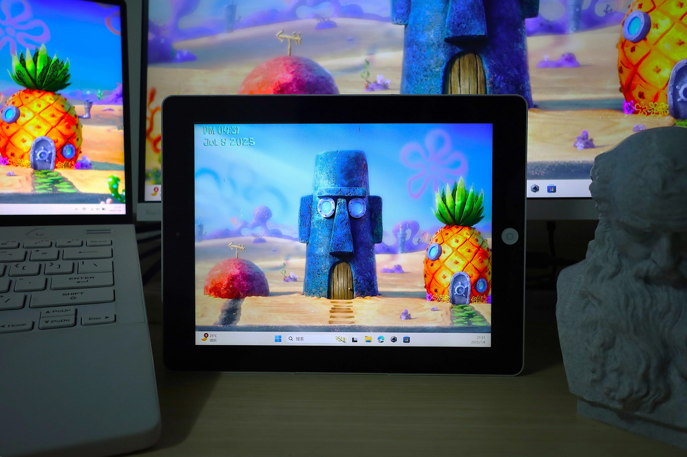
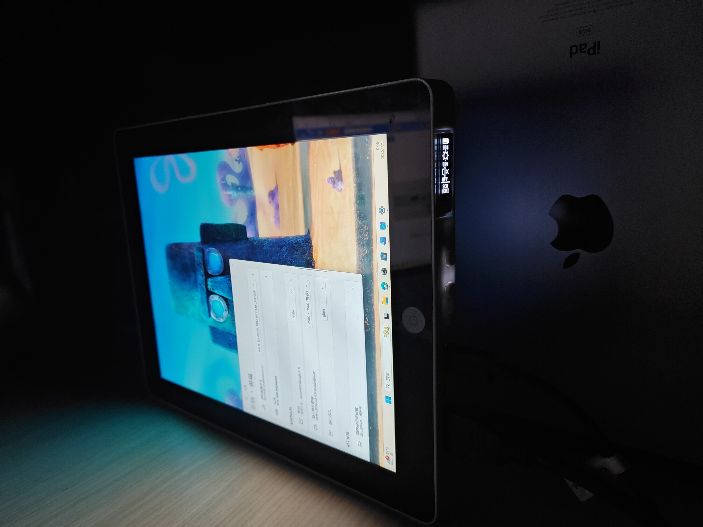
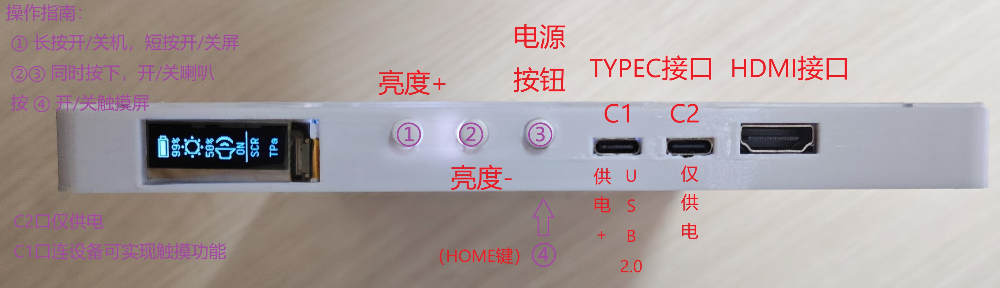
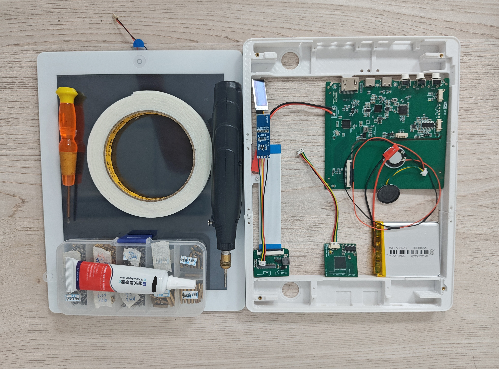
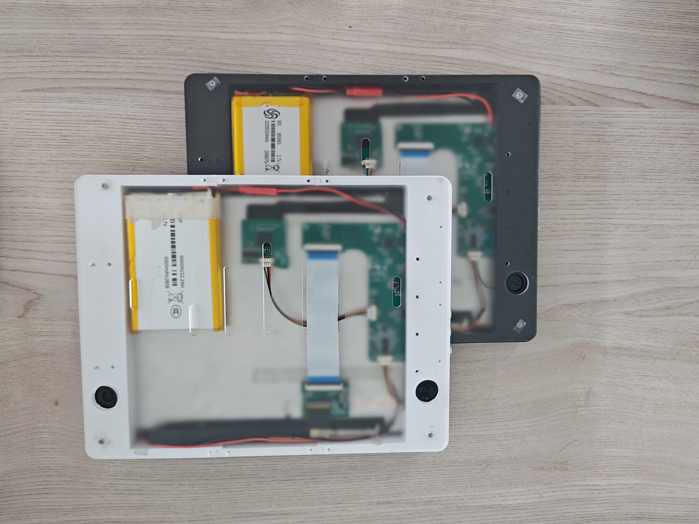

### IPADRESCREEN - iPad 3/4 便携屏改造计划

 
 

### 项目概述

本项目旨在将闲置的 iPad 3/4（A14XX 系列）改造为高性能便携屏，充分复用原设备的屏幕、触控和电池等核心部件，以极低成本实现兼具高分辨率、触控功能和便携性的显示解决方案，适用于嵌入式调试、无人机操控等场景。

### 便携屏参数&#xA;

| 规格&#xA;   | 详情&#xA;                                      |
| --------- | -------------------------------------------- |
| 供电&#xA;   | 5V/1A（USB1），5V/2A（USB2）&#xA;                 |
| 电池容量&#xA; | 自定义（建议 6000mAh 以上）&#xA;                      |
| 功耗&#xA;   | 额定 2W\~4.2W（峰值 4.8W）&#xA;                    |
| 接口&#xA;   | HDMI 1.4 、USB 2.0（支持 HID 触摸设备）&#xA; |
| 显示尺寸&#xA; | 9.7 英寸&#xA;                                  |
| 分辨率&#xA;  | 2048×1536（原 iPad 屏幕原生分辨率）&#xA;               |
| 整体尺寸&#xA; | 241.2×185.7×17mm&#xA;                        |

### 协议及声明&#xA;

- 本项目所开源软件代码遵循 GNU GPL v3.0 许可（见LICENSE文件）；
- 本项目所开源PCB设计文件以及机械结构设计文件遵循 CC-BY-NC-SA-4.0 许可；
- 禁止将本项目整体或部分用于商业用途。如需二次开发或分发，请遵守协议条款，保留原作者信息并以相同协议开源。
- 本项目所使用的技术细节均通过公开渠道、自主研究与测试推导得出。
  
### 前言 ###

在嵌入式计算平台调试等场景中，一款理想的便携屏需满足以下需求：

1.  内置电池，支持电量显示与充电

2.  配备全尺寸 HDMI 接口，触摸功能可开关

3.  屏幕素质优异，避免视觉疲劳

4.  尺寸适中，便于安装在无人车、机、狗等设备上

5.  成本低廉

目前市售便携屏普遍存在价格高、功能冗余等问题，而 10 寸左右的平板虽尺寸合适，但无线投屏体验较差。基于此，本项目选择古早的 iPad 3/4 系列进行改造，其高分辨率屏幕、灵敏触控和大容量电池可完美适配便携屏需求。

### 一\. PCB与机械结构设计

请移步：https://oshwhub.com/trumpx/ipadrescreen-ipad34

### 二\. 软件功能及架构设计

#### 2.1 软件功能
（1）用户操控功能区：

*   **电源键**：长按开关机，短按开关屏

*   **TYPE-C 接口**：C1 口支持数据传输（含触摸功能），C2 口仅供电

*   **HDMI 接口**：用于接入显示信号

*   **按钮功能**：
    *   同时按下亮度 + 和亮度 -：开关喇叭
    *   按亮度 +：增加亮度
    *   按亮度 -：降低亮度
    *   按 HOME 键：开关触摸屏
	
 

***

（2）其它程序执行逻辑：
 * 若HDMI插入（信号跳变），则：开启屏幕，使能功放，开启触摸供电
 * 无HDMI输入，屏幕开启，则：15s自动息屏，45s自动关机
 * 电量低于10%，进入低电量模式（限制最大屏幕亮度为30%）

#### 2.2 软件架构

待补充。

**暂时只提供HEX文件，不提供源码。**

* 主控板STM32的程序置于 **SOFTWARE/MB_STM32** 中

* 触摸小板的CH554参数更新程序程序置于 **SOFTWARE/TP_CH554_UPD** 中

* 触摸小板的CH554模拟HID设备程序置于 **SOFTWARE/TP_CH554_HID** 中

### 三\. 装配流程

#### 器件清单&#xA;

| 类别&#xA;    | 具体器件&#xA;                                        |
| ---------- | ------------------------------------------------ |
| 核心板件&#xA;  | PCB 主板 ×1、触摸小板 ×1、显示小板 ×1、0.91 寸 OLED 模组 ×1&#xA; |
| 连接部件&#xA;  | 4p 电子线 ×3、40P FPC 排线 ×1&#xA;         |
| 原设备复用&#xA; | 触摸屏 ×1、显示屏 ×1、电池 ×1、喇叭 ×2&#xA;                   |
| 结构件&#xA;   | 中框 ×1、后盖 ×1、按键帽 ×3、螺丝（M2×3/M2×6）若干、热熔螺母若干&#xA;   |
| 辅材&#xA;    | 支架胶、海绵胶、泡沫胶&#xA;                                 |

*图 5：装配所需器件*

#### 分步操作(详细步骤请参照 [制造指南.pdf] )&#xA;

**1. 预处理**：

*   用手钻打磨显示屏金手指边缘两侧凸起（不要用剪刀！）

*   用手钻打磨触摸屏金手指内侧两个凸起

**2. 基础装配**：

*   **STEP1**：将 3 个按键帽按入中框对应孔位

*   **STEP2**：用 4 个 M2×6 螺丝将 PCB 主板固定在中框上

*   **STEP3**：从内框长方形孔穿出 OLED 小屏，用支架胶固定，再通过 4p 排线连接主板与小屏（注意保护屏幕和排线）

*   **STEP4**：将喇叭放入中框孔位，用支架胶固定，通过 4p 排线连接主板与喇叭

*   **STEP5**：用 4 个 M2×3 螺丝固定显示屏与中框，连接显示屏排线与触摸小板，再用 40P FPC 排线连接显示小板与主板，最后用泡沫胶将显示小板粘在显示屏背面

*   **STEP6**：用泡沫胶将电池粘在显示屏背面，连接电池与主板

    *此时可测试显示、音频、电源等功能，正常则继续*

**3. 触摸模块装配**：

*   **STEP7**：清理屏幕污渍，将触摸屏排线从显示屏下方穿入并卡入 PCB 下方，调整位置使触摸屏卡紧中框，连接 HOME 按键与主板（注意排线防折）

*   **STEP8**：连接触摸小板与触摸屏，再用 4p 排线连接触摸小板与主板

    *测试触摸功能正常后继续*

**4. 收尾**：

*   **STEP9**：用支架胶粘合触摸屏与中框，安装后盖

### **恭喜！至此你已完成 iPad 3/4 的便携屏改造！**

### 反馈与交流

如有任何问题或建议，欢迎通过 **GitHub** 提交 issue 反馈。

***

> （注：文档部分内容可能由 AI 生成）
>
